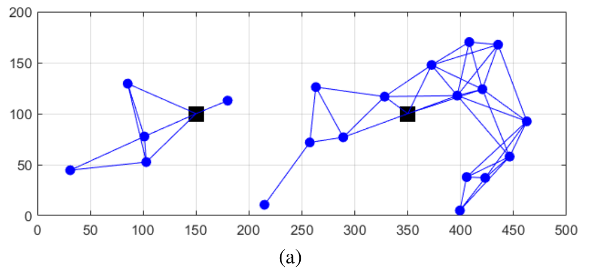
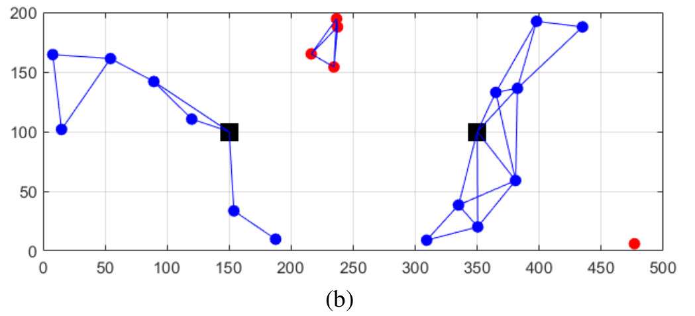
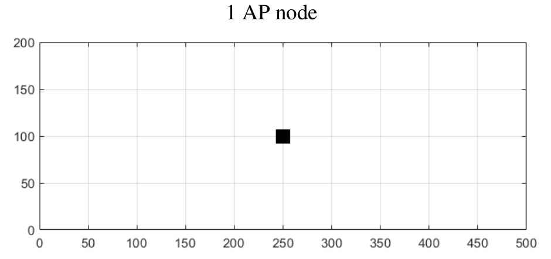
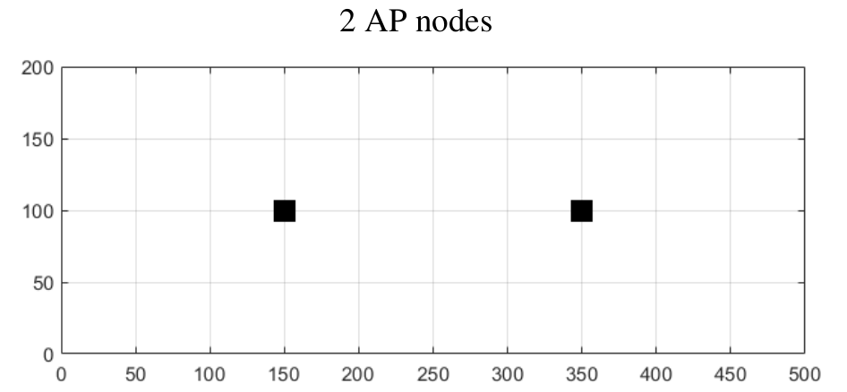
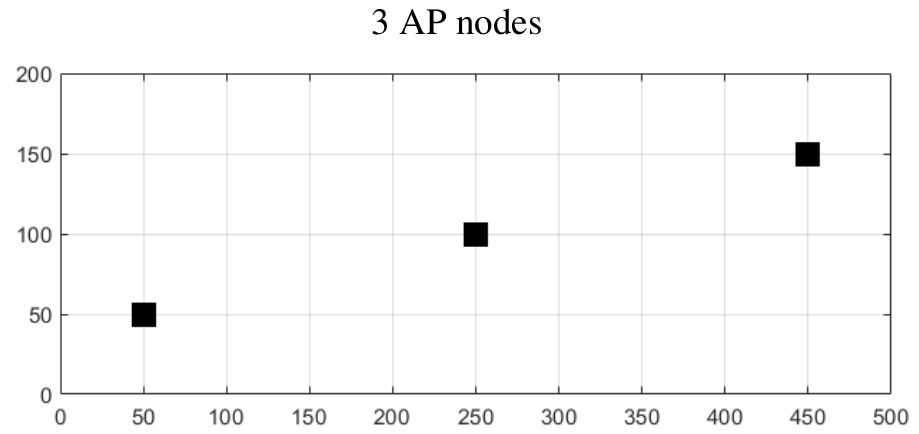
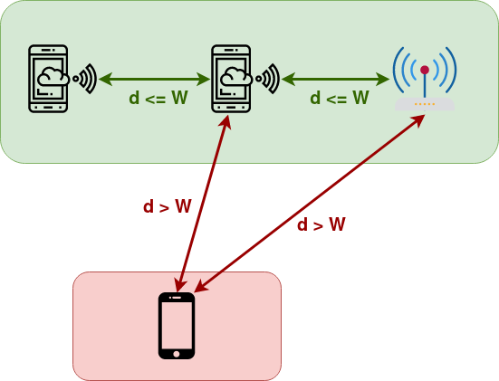

# Simulator of a multi-hop wireless network

Availability performance of multi-hop wireless networks with mobile terminals


## Requirements

- Matlab

## General Description

The aim is to analyse by simulation the availability performance of a multi-hop wireless
network with mobile nodes moving on a given geographical area. The network provides
mobile nodes with Internet access through AP (Access Point) nodes spread over the
geographical area. The wireless network is characterized by a given radio range W, i.e.,
each mobile node establishes a direct wireless link with each of the other nodes (mobile
and AP nodes) whose distance from it is not higher than W.

In multi-hop wireless networks, nodes are able to perform routing, i.e., they forward
data packets received from other nodes and destined to other nodes. So, at each time
instant, a mobile node has connectivity with the Internet if there is a routing path
between it and at least one AP node over the set of established direct wireless links.

The geographical area of the network is defined by a rectangle of 500 horizontal meters
by 200 vertical meters representing an open space campus where mobile nodes can
move freely. Fig 1 presents two snapshots (taken in two different time instants) of a
simulation with 2 AP nodes (represented by black squares), W = 80 meters and 20
mobile nodes (represented by circles). Blue line segments represent established direct
wireless links between nodes. In the snapshot of Fig. 1(a), all mobile nodes have
Internet access since there is at least one routing path from every mobile node to at least
one AP. In the snapshot of Fig. 1(b), there are only 15 mobile nodes with Internet access
and 5 mobile nodes (in red) have no available routing path to any of the AP nodes.





*Fig. 1 – Snapshots of the network with 2 AP nodes in black squares (mobile nodes with
Internet access are in blue and without Internet access are in red): (a) all mobile nodes
have Internet access and (b) 5 mobile nodes do not have Internet access.*

The Internet access availability is the probability of a node to be connected to the
Internet. For each node, it can be estimated by the percentage of time it is connected to
at least one AP node. The aim is to estimate the average and the minimum availability
among all mobile nodes.

The network to be simulated is a continuous time system (i.e., the location of the mobile
nodes varies continuously over time). To develop the simulator, consider that time is
discretized in time slots with equal time duration. Then, the simulator computes only the
state of the system at the beginning of each time slot (the slot duration is a trade-off
between simulation running time and results accuracy: a smaller slot duration increases
the simulation runtime and also increases the results accuracy).

## Simulator Development

Develop a MATLAB function named simulatorFunction implementing a simulator
of a multi-hop wireless network as described in the previous section, taking as starting
point the MATLAB function provided in file simulatorFunction.m (this function
already implements the movement simulation of mobile nodes and the simulation
visualization). The aim of the simulator is to estimate 2 performance parameters: the
average and the minimum Internet access availability among all mobile nodes.
The input and output parameters of the simulator are:

```
    >> help simulatorFunction
    [AvgAvail, MinAvail]= simulatorFunction(N,S,W,dlt,T,AP,pl)
    
    Input parameters:
        N - no. of mobile nodes
        S - maximum absolute speed of mobile nodes (in km/h)
        W - radio range (in meters)
        dlt - time slot duration (in seconds)
        T - no. of time slots of the simulation
        AP - matrix with one row per AP node and 2 columns where the first column has the horizontal coordinates and the second column has the vertical coordinates of the AP nodes
        pl - plot option: 
            0 - nothing;
            1 - nodes' movement;
            2 - nodes' movement and connectivity
    
    Output parameters:
        AvgAvail - average availability among all mobile nodes
        MinAvail - minimum availability among all mobile nodes
```
Concerning the AP configuration in terms of number of AP nodes and their locations, consider the following 3 AP configurations:







## Implementation

For each AP configuration and each of the cases defined in the following table, run 10 simulations and determine the average and the minimum availability of the
Internet access among all nodes together with the 90% confidence intervals (run each simulation with a time slot duration of 1 second and T = 7200 time slots).

Considering:



## Struct of this project:

- Code to implement simulator was on the file simulatorFunction.m

- Script.m was used to obtained the studied values

- At plots directory you can see the obtained plots. To this plot was runned plots.m.


## Authors

* **Catarina Silva** - [catarinaacsilva](https://github.com/catarinaacsilva)

## License

This project is licensed under the MIT License - see the [LICENSE](LICENSE) file for details